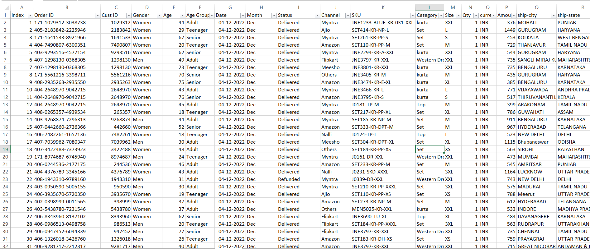
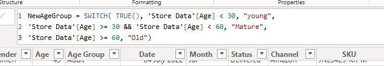
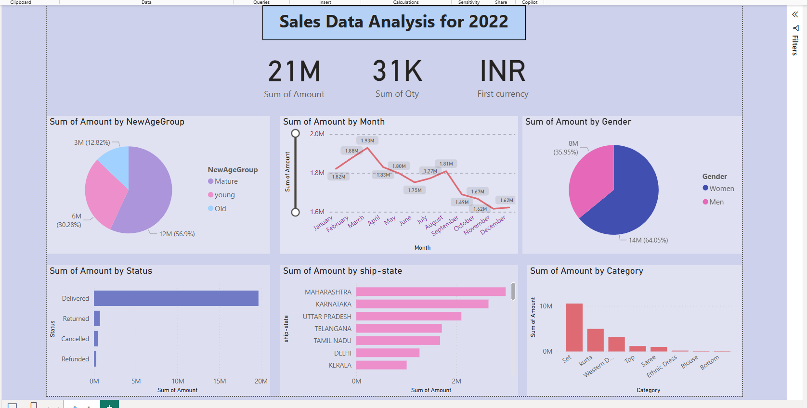

# Sales-Analysis-Using-Power-BI

## Project Overview
This project involves analyzing raw sales data for a company using **Power BI**. The goal was to clean, refine, and transform the data into meaningful insights using **DAX commands** and an **interactive dashboard**.

## Data Preparation
1. **Cleaning & Refining the Data:**
   - Filled missing values.
   - Handled null entries.
   - Removed unnecessary and duplicate entries.

2. **Data Transformation:**
   - Added new calculated columns using **DAX logical functions**.
   - Utilized the **SWITCH** function to categorize data and improve readability.
  

## Dashboard & Insights
An interactive Power BI dashboard was created to visualize key metrics, including:
- **Sales by Gender**: Understanding sales distribution across male and female customers.
- **Sales by State**: Identifying high and low-performing states.
- **Articles Sold**: Analyzing product popularity.
- **Sales by Month**: Recognizing seasonal trends and patterns.

## Tools & Technologies Used
- **Power BI** for data visualization and dashboard creation.
- **DAX (Data Analysis Expressions)** for calculated columns and logical functions.
- **Data Cleaning Techniques** to refine the dataset.

## Conclusion
The project successfully transformed raw sales data into an interactive and insightful Power BI dashboard, providing actionable business insights for decision-making.

---
### 🚀 Future Improvements
- Integrate **machine learning models** for predictive analytics.
- Automate data updates using **Power BI Service**.
- Enhance dashboard with **more advanced DAX measures** for deeper insights.

